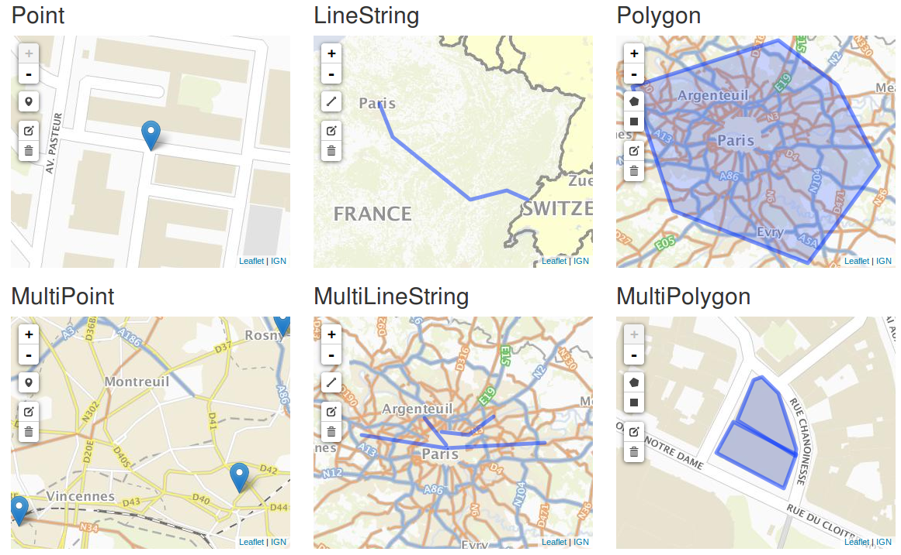

# Sample markdown file

[[toc]]

## Description

This file provides a sample markdown for markdown2html

## Images



## Code without language

```
A code
```

## JS code

```javascript
function doSomething(){
    return "something";
}
```

## Inline code

Rendering an inline `doSomething()` code.

## Mermaid graph


## Links

### External markdown with relative path

* [Other file](other-file.md)
* [Part in other file](other-file.md#nacta-contribuere)

### External markdown with absolute path

* [GitHub link](https://github.com/jquery/jquery/blob/master/README.md)
