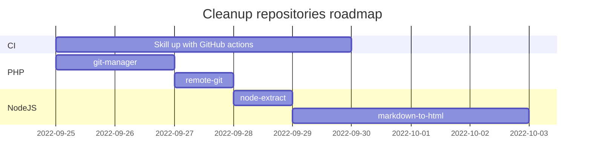
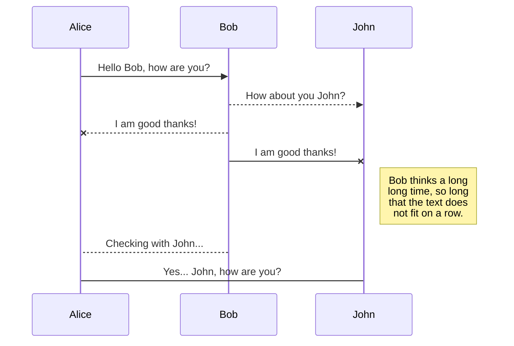

# Graphs with mermaid

This is a **sequence diagram** generated by [Mermaid](https://mermaid-js.github.io/mermaid/#/) which is integrated in the default layout :

[[toc]]

## Gantt

## Sequence diagram

## And more!

See [mermaid documentation](https://mermaid-js.github.io/mermaid/#/).

[Back to home...](../)
