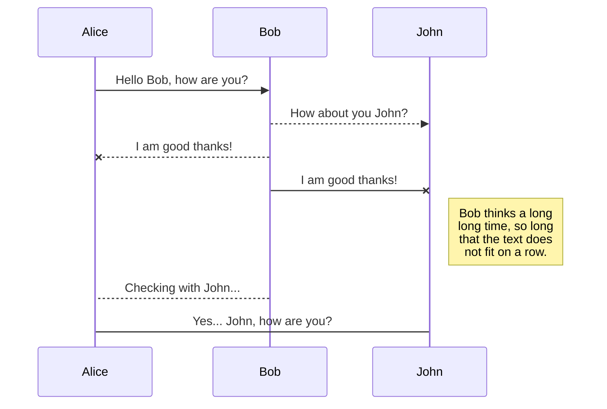

# Sample markdown file

This file provides a sample content for the default layout.

## Table of content

[[toc]]

### HTML views

The content of [demo/index.html](demo/index.html) is included in the layout so that it is possible to mix markdown and lightweight HTML/JS samples.

### Links

* Internal markdown links with relative path

  * [Another file](other-file.md)
  * [A specific part in another file](other-file.md#nacta-contribuere)

* External markdown with absolute path

  * [GitHub link](https://github.com/jquery/jquery/blob/master/README.md)


## Features for the default template

### Code formatting with highlight JS

```javascript
function doSomething(){
    return "something";
}
```

### Math formula with mathjax

$$
x = {-b \pm \sqrt{b^2-4ac} \over 2a}.
$$

### Graphs with mermaid {#mermaid}



## That's all!

This part is joinable from "Table of content" as `smartypants` is defined to `true`. Otherwize `# Let's rock!` is turned into the following token :

```json
{
  type: 'heading',
  raw: "# Let's rock!",
  depth: 1,
  text: "Let&#39;s rock!"
}
```

> Debug : See [reproduction in forked test/unit/Lexer-spec.js](https://github.com/mborne/marked/commit/ad2cb211431824e882b9ca9fa0e3700ba9854148). It might be usefull to forward `token.type` at this line [Lexer.js#L473](https://github.com/markedjs/marked/blob/v4.1.1/src/Lexer.js#L473) to force the use of `smartypants` for `headings`? I'll probably open an issue.


